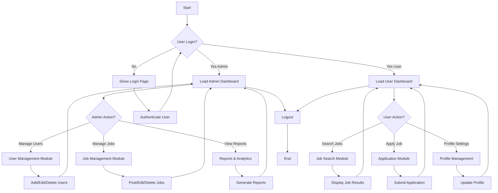

## 📦 High‑Level Overview of **Hospital‑Dashboard**  

The **Hospital‑Dashboard** repository is a **React + Vite** web application (with optional Electron packaging) that provides a **complete admin & doctor portal** for a hospital management system.  

| Aspect | Details |
|--------|---------|
| **Framework** | React 18 (future‑ready), bundled with Vite for lightning‑fast dev & build. |
| **UI Library** | Material‑UI (`@mui/material`, `@mui/icons-material`) + custom CSS. |
| **State & Routing** | React Context for auth state, React‑Router‑Dom v6 for navigation. |
| **Charts & Analytics** | `chart.js`, `react‑chartjs‑2`, `recharts` for line, bar, and pie charts. |
| **Real‑time Chat** | `socket.io-client` integrated in `ChatRoom.jsx`. |
| **Export & Reporting** | `xlsx` for spreadsheet export, `jspdf` + `jspdf‑autotable` for PDF reports. |
| **Animations** | `lottie-react` for loading & UI animations (JSON files in `/public`). |
| **Electron** | `electron.mjs` + `electron‑builder` config to ship a native desktop app (Windows). |
| **CI/CD** | GitHub Actions workflow (`/.github/workflows/deploy.yml`) that builds & deploys to Netlify on every push to `main`. |
| **Linting** | ESLint with React and React‑Refresh plugins; strict “no‑warnings” rule. |
| **Auth Flow** | Two parallel auth contexts – **admin** and **doctor** – each with its own set of protected routes. |

---

## 🔍 Detailed Feature Breakdown  

### 1. Authentication & Context  
* **`src/main.jsx`** creates a **React Context** (`Context`) that stores:  
  * `isAuthenticated` / `setIsAuthenticated` – admin login status.  
  * `isDoctorAuthenticated` / `setIsDoctorAuthenticated` – doctor login status.  
  * `admin` & `doctor` objects – profile data returned from the backend API.  

* **`src/App.jsx`** fetches the logged‑in user (`/api/v1/user/admin/me` or `/api/v1/user/doctor/me`) on mount and updates the context accordingly.  

### 2. Routing (React‑Router‑Dom)  
| Route | Component | Who can access |
|-------|-----------|----------------|
| `/login` | `Login.jsx` | Public (both roles) |
| `/` | `Dashboard.jsx` (admin) / `DoctorDashboard.jsx` (doctor) | Authenticated admin **or** doctor (fallback decides) |
| `/doctor/addnew` | `AddNewDoctor.jsx` | Admin only |
| `/admin/addnew` | `AddNewAdmin.jsx` | Admin only |
| `/messages` | `Messages.jsx` | Admin only |
| `/doctors` | `Doctors.jsx` | Admin only |
| `/admin/profile` | `AdminProfile.jsx` | Admin only |
| `/PatientsDashboard` | `getAllpasent.jsx` | Admin only |
| `/description-bill` | `MedicalDescriptions.jsx` | Admin only |
| `/description/:id` | `DescriptionDetailPage.jsx` | Admin only |
| `/ChatRoom` | `ChatRoom.jsx` | Admin only |
| `/DocterDashboard` (typo) | `DoctorDashboard.jsx` | Doctor only |
| `*` | Fallback – redirects to appropriate dashboard or login. |

### 3. Admin Dashboard (`src/components/Dashboard/*`)  
* **Stats Cards** – number of doctors, patients, appointments, etc.  
* **Line Graph** – `DashboardMainLineGraph.jsx` (Chart.js) showing metrics over time.  
* **Recent Activities** – tables with export buttons (XLSX, PDF).  
* **Admin Management** – `DashboardAdmins.jsx` lists admin team, shows pop‑up details.  

### 4. Doctor Dashboard (`src/components/Doctor/*`)  
* **Header** – `DashboardHeader.jsx` with profile avatar, notifications, and dropdown.  
* **Skeleton Loader** – `DashboardSkeleton.jsx` shows placeholders while data loads.  
* **Main Graphs** – reusable line/mini‑graph components.  

### 5. Chat Room (`src/components/ChatRoom.jsx`)  
* Real‑time messaging powered by **Socket.io**.  
* Simple UI with message list, input box, and send button.  

### 6. Data Export & PDF Generation  
* **XLSX** – export patient/appointment tables via `xlsx`.  
* **PDF** – generate printable reports with `jspdf` and `jspdf‑autotable`.  

### 7. Lottie Animations (`/public/*.json`)  
* Loading animation (`loding.json`), login animation, 404 animation, and profile animation – all rendered with `lottie-react`.  

### 8. Electron Desktop Build  
* `electron.mjs` loads the hosted web app inside a native window.  
* `package.json → build` config uses `electron-builder` to create a Windows installer (`nsis`).  

### 9. CI/CD (Netlify)  
* GitHub Action checks out code, installs dependencies, builds the Vite app (`npm run build`), then deploys the `dist` folder to Netlify using stored secrets (`NETLIFY_AUTH_TOKEN`, `NETLIFY_SITE_ID`).  

---

## 📂 File Structure (condensed)  

```
Hospital-Dashboard/
├─ .eslintrc.cjs
├─ .gitignore
├─ .github/
│   └─ workflows/
│       └─ deploy.yml
├─ README.md
├─ assets/
│   └─ icons/
│       └─ win/icon.ico          ← Windows installer icon
├─ electron.mjs                  ← Electron entry point
├─ index.html
├─ launch-log.txt
├─ netlify.toml
├─ package.json
├─ package-lock.json
├─ public/
│   ├─ loding.json
│   ├─ login aimation.json
│   ├─ notfountAnimation.json
│   ├─ profile-animation.json
│   └─ vite.svg
├─ src/
│   ├─ App.css
│   ├─ App.jsx
│   ├─ api.js
│   ├─ components/
│   │   ├─ AddNewAdmin.jsx
│   │   ├─ AddNewDoctor.jsx
│   │   ├─ AdminProfile.jsx
│   │   ├─ ChatRoom.jsx
│   │   ├─ Dashboard/
│   │   │   ├─ Dashboard.jsx
│   │   │   ├─ DashboardAdmins.jsx
│   │   │   ├─ DashboardAppointments.jsx
│   │   │   └─ DashboardStats.jsx
│   │   ├─ DescriptionDetailPage.jsx
│   │   ├─ Doctor/
│   │   │   ├─ DashboardHeader.jsx
│   │   │   ├─ DashboardMainLineGraph.jsx
│   │   │   ├─ DashboardSkeleton.jsx
│   │   │   ├─ DocterDashboardStats.jsx
│   │   │   └─ DoctorDashboard.jsx
│   │   ├─ Doctors.jsx
│   │   ├─ FloatingButton.jsx
│   │   ├─ Login.jsx
│   │   ├─ MedicalDescriptions.jsx
│   │   ├─ Messages.jsx
│   │   ├─ Sidebar.jsx
│   │   └─ getAllpasent.jsx
│   └─ main.jsx
└─ vite.config.js
```

---

## 📈 High‑Level Flow (Mermaid Diagram)  



---

## 🛠️ Installation & Running Locally  

| Step | Command |
|------|---------|
| **1️⃣ Clone repo** | `git clone https://github.com/Aayushajs/Hospital-Dashboard.git` |
| **2️⃣ Enter directory** | `cd Hospital-Dashboard` |
| **3️⃣ Install dependencies** | `npm install` |
| **4️⃣ Run development server** | `npm run dev` <br>→ Vite will start at `http://localhost:5173` (or the port shown in the console). |
| **5️⃣ Build for production** | `npm run build` (outputs to `dist/`) |
| **6️⃣ Preview production build** | `npm run preview` |
| **7️⃣ Electron (optional)** | `npm run electron` – launches the Electron wrapper that loads the hosted Netlify URL (`https://jainamdashbord.netlify.app`). |
| **8️⃣ Create Windows installer** *(requires Windows env or Wine)* | `npm run dist` – generates an NSIS installer in `dist/`. |

> **Note:** The repository uses **Vite** (`vite.config.js`) and **ESM** (`"type": "module"` in `package.json`). Ensure Node ≥ 18 is installed.

---

## 🔐 Test Login (Admin)  

**Credentials**  
```
Email    : aayushj004@admin.com
Password : 123456
```

### Manual Test Steps  

1. Open the app (`npm run dev` → `http://localhost:5173`).  
2. Click **Login** (or navigate directly to `/login`).  
3. Enter the above email & password, then submit.  
4. On success you will be redirected to the **Admin Dashboard** (`/`).  
5. Verify:  
   * Sidebar appears with admin‑only links (Add New Doctor, Messages, etc.).  
   * Top‑right avatar shows the admin’s initials.  
   * The **DashboardAdmins** card lists the admin team; your own entry has a “You” badge.  
6. To test logout, you can clear cookies or modify the context (the repo does not include an explicit logout button, but you can remove the `isAuthenticated` flag manually in dev tools).  

If the login fails, a toast error appears (handled by `react-toastify`).  

---

## 🎨 UI / UX Highlights  

* **Responsive layout** – the sidebar collapses on screens < 1208 px, the dashboard adjusts margins accordingly.  
* **Dark‑mode friendly** – most components use dark backgrounds with subtle accent colors.  
* **Skeleton loaders** – `DashboardSkeleton.jsx` keeps the UI smooth while awaiting API data.  
* **Lottie animations** – playful loading and error visuals that improve perceived performance.  

---

## 📦 What’s Missing / Possible Improvements  

| Area | Suggested Enhancement |
|------|-----------------------|
| **Logout** | Add a logout endpoint + button that clears auth cookies and context. |
| **Role‑based route guards** | Centralise route protection in a wrapper component rather than scattering checks. |
| **Unit tests** | Integrate Jest + React Testing Library for component testing. |
| **Docker** | Provide a Dockerfile for containerised deployment (backend not included). |
| **Internationalisation** | Use `react-i18next` for multi‑language support. |
| **Accessibility** | Add ARIA labels, keyboard navigation focus styles, and colour‑contrast checks. |

---

## 📚 Quick Reference – Key Files  

````
js path="src/api.js"
export const API_BASE_URL = "https://jainam-hospital-backend.onrender.com";
````

````
js path="src/main.jsx"
import { createContext, useState } from "react";
export const Context = createContext({ isAuthenticated: false, isDoctorAuthenticated: false });
````

````
jsx path="src/App.jsx"
{/* Routing logic – shows Sidebar only for authenticated users; renders admin or doctor dashboards based on auth state. */}
````

````
jsx path="src/components/Dashboard/DashboardAdmins.jsx"
{/* Admin list with selectable popup for detailed view. */}
````

````
jsx path="src/components/Doctor/DashboardHeader.jsx"
{/* Header for doctor dashboard with avatar, notifications, and dropdown. */}
````

---

**Enjoy exploring the Hospital‑Dashboard!** If you need further customisation (e.g., adding new API endpoints, tweaking the chart colors, or extending the Electron build), the code is modular and well‑separated, making it straightforward to extend. 🚀

**Contect** 
````
aayushj004@gmail.com

````
